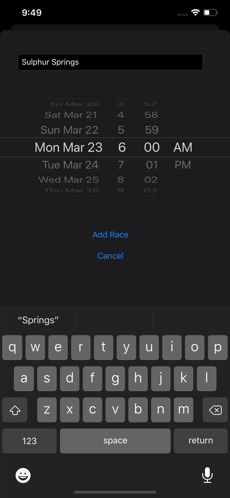
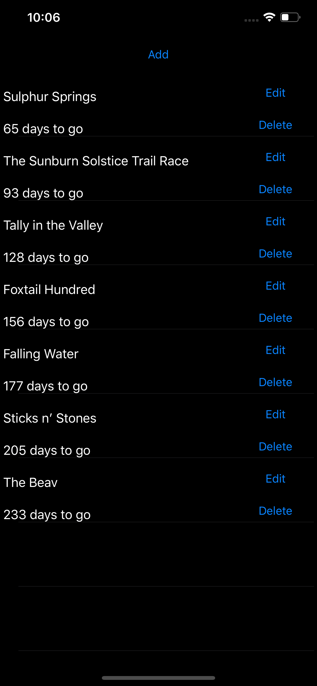

# RaceDayCountDown

Add up coming races and see how much time is left before the race starts. Get 3 reminder notifications at 25, 10, and 3 days before the race starts. This is really helpful for when you sign up for a bunch of races and forget about them. This is especially useful when you sign up for a race that is far in the future and forget about it. The reminder will at least give you a 25 day notice.

# Future Improvements

- A better spacing on notifcations. For example if you sign up for a race 6 months from now it would be great to a notifcation at 3 months, 1 month, and 1 week.
- A calendar view of the races you've signed up for.
- A way to priortize the races and have them show differently. So an A race would be bigger/brigher then a C race.
- More information about the race when you sign up for it like the distance you plan to run and the location. Could you have an share link to go to a map to get directions.

# Dev Notes

I wrote this simple app to get more familiar with notifications.

# Adding a New Race

# Viewing Races (Main Screen)

